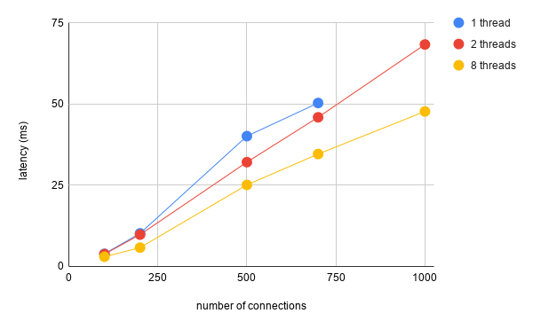

# echo-server

An async TCP echo server in two flavors, using
[Boost.Asio](https://www.boost.org/doc/libs/1_70_0/doc/html/boost_asio.html) and
[Folly.Async](https://github.com/facebook/folly/tree/master/folly/io/async), mainly to show the
difference between those two libraries in terms of async socket programming.

## Build

To build the project you need to have `cmake` >= 3.12, `boost` >= 1.70.0 and `folly` installed. On
macOS all dependencies can be installed via `brew`.

## Run

After building, the given build directory contains two subdirectories, `boost-asio` and
`folly-async`. Each of those subdirectories contains a binary, `<flavor>-echo-server`, which
accepts the following set of command-line arguments:

```
<port> <read buffer in KiB> <threads> [process]
```

 - `port`: the listening port
 - `read buffer in KiB`: the size of the read buffer, i.e. how many bytes to accept in a single
     async read operation
 - `threads`: the total number of threads (listening and connection handling)
 - `process` (optional): if the fourth argument is `process`, the bytes read will be split by line
     before echoing back (see below)

### Line processing

The `process` flag was added to simulate a server using a line-based protocol, which needs to split
a buffer into lines after reading, e.g. to put them on a job queue. This is to show the difference
between echoing back the whole buffer vs breaking down the received bytes line-by-line before
responding.

## Load

For automated testing with many connections I used [tcpkali](https://github.com/satori-com/tcpkali).
Using the `message.marker` setting, `tcpkali` will automatically calculate response latency,
for example:

```shell
$ tcpkali -c 100 --connect-rate 100 -r 1000 -T 10s -em "\{message.marker}\n" --write-combine off --latency-percentiles 50 127.0.0.1:7000
```

The above command-line would run `tcpkali` and establish 100 connections in total (at a rate of
100 new connections per second), send 1000 messages per second, run for 10 seconds, and at the end
report the median latency. In this example, individual messages only contain the `message.marker`
and a `\n`, which makes them 31 bytes in size.

## Experiments

I experimented with the following configuration:

 - Number of threads: 1, 2, 8
 - Number of connections: 100, 200, 300, 500, 700, 1000

Settings that were kept constant:

 - Number of messages per second: 1000
 - Total test duration: 10 seconds
 - Size of the read buffer: 16 KiB
 - Size of individual messages: 31 bytes (using above mentioned `message.marker` to get latency
   results)

`tcpkali` was run as shown above, only changing the `-c` and `--connect-rate` arguments to match
the desired number of connections.

## Results

The following sections show the median response latency in milliseconds as reported by `tcpkali`.
The servers were run without the `process` flag. If `tcpkali` consistently couldn't report results
for a specific case, missing results are marked as *n/a*.

### Boost.Asio



| | 100 connections | 200 connections | 500 connections | 700 connections | 1000 connections |
| - | - | - | - | - | - |
| **1 thread** | 3.9 | 10.2 | 40.1 | 50.3 | *n/a* |
| **2 threads** | 3.8 | 9.8 | 32.1 | 45.9 | 68.3 |
| **8 threads** | 3 | 5.8 | 25.1 | 34.6 | 47.7 |

### Folly.Async


| | 100 connections | 200 connections | 500 connections | 700 connections | 1000 connections |
| - | - | - | - | - | - |
| **1 thread** | 2.4 | 6.3 | 23.5 | 31.3 | 42 |
| **2 threads** | 2.7 | 6.3 | 22.3 | 31.9 | 42.6 |
| **8 threads** | 2.8 | 6.5 | 22.8 | 32.2 | 43.9 |
